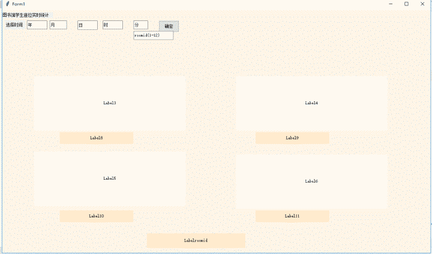

# libary_seat_inquiry
图书馆座位分配查询
## 工程需求
图书馆为每个同学分配固定的座位。依据课表，如果座位上的同学没课，座位状态显示为”占用”;如果有课，座位状态显示为“空闲xx分钟”。
## 运行截图
 
## 事先约定
一天十节课的时间安排，开学时间为2019年3月4号
```
课   时间
1-2  8:00-9:30
3-4  10:00-11:30
5-6  13:00-14:30
7-8  15:00-16:30
9=10 18:00-19:30
```
## 任务分配
侯晓蔚 类设计 表格处理 <br>
童学衡 数据处理 判断逻辑 <br>
郑余祥 界面设计 生成可执行文件 <br>
